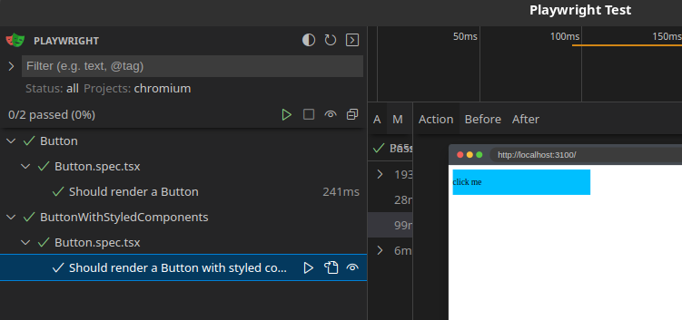
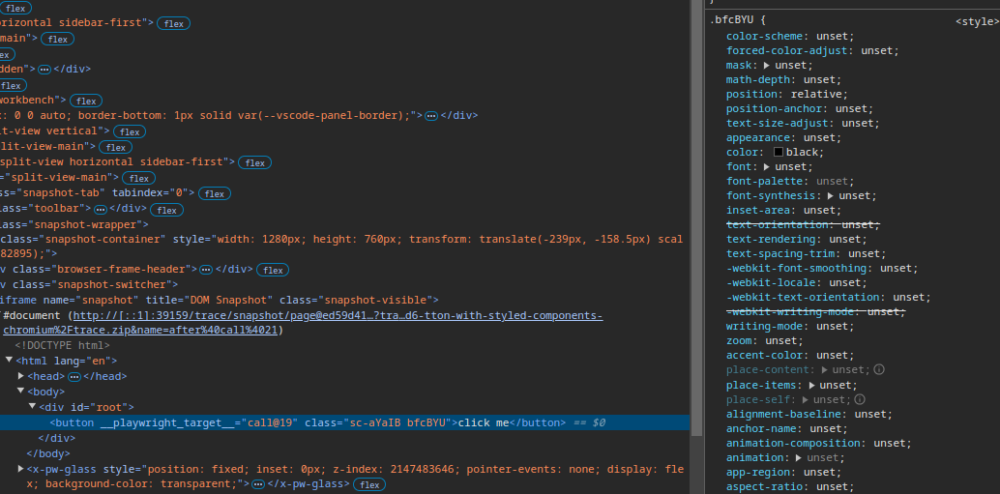

## Playwright component testing ui rendering error

In this repo i would like to show a rendering error we are facing in our project.
I created a button component with some css based on `all: unset`.

As you can see in the snapshot created by playwright the button should have a border radius and padding.

Sadly in the playwright ui the border radius and paddings are not visible:

In the chromium developer tools i can see that the css attributes are not in the correct order:

Interestingly the playwright ui renders correctly with css modules instead of styled components.
In both cases the snapshots will be rendered correctly.